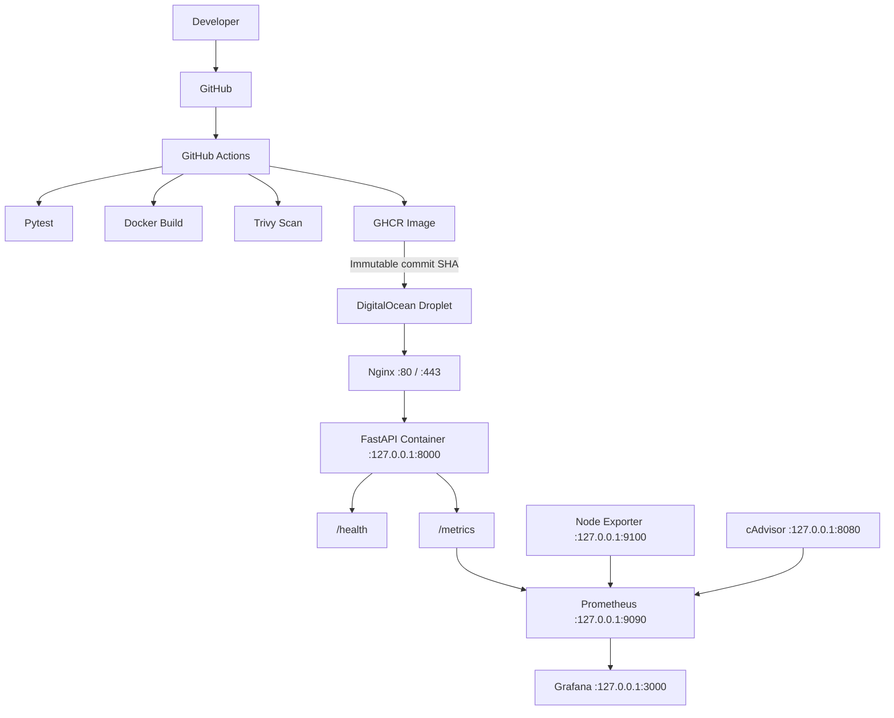

# FastAPI DigitalOcean CI/CD

[](https://github.com/Hashirislamdawar/fastapi-digitalocean-cicd/actions/workflows/ci.yml)

A production-style CI/CD pipeline for a containerized FastAPI service using GitHub Actions, GHCR, Terraform, DigitalOcean, Nginx, Trivy, Prometheus, and Grafana.

This DevOps portfolio project demonstrates automated testing, containerization, infrastructure provisioning, secure immutable deployment, health verification, rollback, and observability.

## Highlights

- Automated CI/CD with GitHub Actions
- Three-test pytest suite for the FastAPI API
- Docker image publishing to GitHub Container Registry
- Immutable commit-SHA production deployments
- DigitalOcean Droplet provisioned with Terraform
- Nginx reverse proxy with FastAPI kept on localhost
- Trivy HIGH/CRITICAL vulnerability scanning
- Docker, direct HTTP, and Nginx health checks
- Automatic rollback after failed deployment verification
- Production deployment concurrency protection
- Deployment audit logging
- Prometheus application and infrastructure metrics
- Grafana monitoring dashboard
- Node Exporter host monitoring
- cAdvisor Docker container monitoring

## Architecture



The monitoring services are installed on the existing Droplet and remain localhost-only. The production dashboard is configured in Grafana rather than stored as repository provisioning code.

## CI/CD Pipeline

```text
git push
  |
  v
Run pytest
  |
  v
Build Docker image
  |
  v
Report and gate Trivy findings
  |
  v
Push image to GHCR
  |
  v
SSH to DigitalOcean
  |
  v
Pull commit-SHA image
  |
  v
Replace FastAPI container
  |
  v
Docker health polling
  |
  v
FastAPI and Nginx health checks
  |
  v
Deployment complete or automatic rollback
```

The workflow runs tests and image validation for pushes to `main` and `develop` and pull requests targeting `main`. Production deployment runs only for pushes to `main` and is serialized with the `production-deploy` concurrency group.

The image deployed to production is:

```text
ghcr.io/hashirislamdawar/fastapi-digitalocean-cicd:${{ github.sha }}
```

The mutable `latest` tag is published for registry convenience, but the deployment job uses the immutable commit-SHA tag. The deployment is a replacement rollout: the current container is stopped before the new one starts, so it is not presented as zero-downtime deployment.

## Rollback

Before changing the running service, the deployment:

1. Captures the image currently used by `fastapi-api`.
2. Pulls and inspects the new immutable image.
3. Stops and removes the old container.
4. Starts the new container with the existing name, loopback port mapping, and restart policy.
5. Polls Docker's native health status for up to 60 seconds.
6. Verifies the direct FastAPI endpoint and the Nginx endpoint.

If verification fails, the failed container is removed, the captured image is restored, and rollback health is checked. The deployment remains failed after rollback so a failed release is not reported as successful. This rollback path was intentionally exercised during development.

## Infrastructure as Code

Terraform in `terraform/` defines:

- A DigitalOcean Ubuntu 22.04 Droplet
- Region `nyc3`
- Configurable Droplet size, defaulting to `s-1vcpu-1gb`
- Lookup of an existing DigitalOcean SSH key
- DigitalOcean firewall rules for TCP ports 22, 80, and 443
- Droplet ID, name, and public IP outputs

The DigitalOcean token is a sensitive Terraform variable. Terraform state, real variable files, and the `.terraform/` directory are excluded from Git. The provider lock file is kept available for reproducible provider selection.

Terraform commands are intentionally manual:

```bash
cd terraform
terraform init
terraform fmt
terraform validate
terraform plan
```

Review the plan before applying infrastructure changes. This repository does not run Terraform automatically in GitHub Actions.

## Security

Implemented controls include:

- Trivy scanning for OS and library vulnerabilities at HIGH and CRITICAL severity
- A deployment gate for fixable HIGH/CRITICAL findings
- Immutable SHA-based image deployment
- SSH host-key pinning with no `StrictHostKeyChecking=no`
- Least-privilege GitHub Actions permissions
- Deployment SSH key supplied through the `DO_SSH_PRIVATE_KEY` repository secret
- Temporary SSH credential cleanup in both SSH jobs
- Docker-native health checks and post-deployment verification
- Automatic rollback on failed health verification
- Monitoring services bound to localhost
- DigitalOcean firewall exposure limited to the configured public ports
- Terraform state, variable files, environment files, and private-key patterns excluded from Git

HTTPS is not currently configured. The current public reverse-proxy path is HTTP through Nginx on port 80.

## Monitoring

Prometheus is the metrics backend for the application, host, and container layers.

### FastAPI

The application exposes Prometheus metrics at `/metrics`, including:

- `http_requests_total` for request rate and HTTP status analysis
- `http_request_duration_seconds` for latency analysis

The Grafana dashboard uses these metrics for request rate, HTTP 5xx rate, P95 latency, and target health.

### Node Exporter

Node Exporter provides host metrics for:

- CPU utilization
- Memory utilization
- Root filesystem usage
- System load

### cAdvisor

cAdvisor provides Docker container metrics for:

- Container CPU
- Container memory
- Container network receive rate
- Container network transmit rate

### Grafana dashboard

The production-style dashboard is named **FastAPI CI/CD Infrastructure & Application Monitoring** and uses UID `fastapi-devops-monitoring`. It has application, server health, Docker/container, and monitoring-status sections with a 15-minute default view and 30-second refresh interval.

No dashboard screenshot is committed to the repository. The dashboard is maintained in the server-side Grafana instance.

## Project Structure

```text
fastapi-digitalocean-cicd/
├── app/
│   ├── __init__.py
│   └── main.py                 # FastAPI routes and Prometheus instrumentation
├── tests/
│   ├── __init__.py
│   └── test_api.py             # API endpoint tests
├── .github/
│   └── workflows/
│       └── ci.yml              # Tests, image build, scan, push, and deployment
├── terraform/
│   ├── .gitignore              # State and local Terraform secret protection
│   ├── .terraform.lock.hcl     # Provider lock file
│   ├── main.tf                 # Droplet, SSH key lookup, and firewall
│   ├── outputs.tf              # Infrastructure outputs
│   ├── terraform.tfvars.example
│   └── variables.tf
├── Dockerfile                  # FastAPI image and native health check
├── docker-compose.yml          # Local development service
├── requirements.txt            # Python dependencies
├── .dockerignore
├── .gitignore
└── README.md
```

Local Terraform state, `.terraform/`, real `terraform.tfvars`, environment files, and private keys are intentionally omitted from the documented tree.

## Local Development

```bash
git clone https://github.com/Hashirislamdawar/fastapi-digitalocean-cicd.git
cd fastapi-digitalocean-cicd
python -m venv .venv
source .venv/bin/activate
pip install -r requirements.txt
python -m pytest
uvicorn app.main:app --reload
```

On Windows PowerShell, activate the virtual environment with:

```powershell
.\.venv\Scripts\Activate.ps1
```

The API is available at `http://127.0.0.1:8000`.

### Docker Compose

The Compose file defines the local `api` service and maps port 8000:

```bash
docker compose up -d --build
docker compose ps
docker compose logs api
docker compose down
```

Compose is intended for local use. The production deployment binds FastAPI to `127.0.0.1:8000` behind Nginx.

## Testing

Run:

```bash
python -m pytest
```

The current suite contains 3 tests covering the root, health, and version endpoints. The metrics endpoint and monitoring stack are additionally verified through container and Prometheus/Grafana integration checks.

## Docker

Build and run the image locally:

```bash
docker build -t fastapi-digitalocean-cicd:local .
docker run -d --name fastapi-api-local -p 127.0.0.1:8000:8000 fastapi-digitalocean-cicd:local
docker ps
docker logs fastapi-api-local
docker rm -f fastapi-api-local
```

The Dockerfile uses Python 3.12 slim Bookworm, installs dependencies without a pip cache, exposes a native health check, and starts Uvicorn. The image listens on port 8000 inside the container.

## API Endpoints

| Method | Path | Purpose |
| --- | --- | --- |
| GET | `/` | Application status response |
| GET | `/health` | Deployment and container health check |
| GET | `/version` | Application version response |
| GET | `/metrics` | Prometheus-format application metrics |
| GET | `/docs` | FastAPI Swagger UI |

## Production Deployment

Production deployment requires the configured GitHub repository secret:

- `DO_SSH_PRIVATE_KEY`

The workflow authenticates to the existing `deploy` user using the pinned server ED25519 host key. It does not expose secret values in the repository or logs.

At a high level, deployment:

1. Builds and scans the image.
2. Pushes the commit-SHA image to GHCR.
3. Connects to the Droplet over SSH.
4. Pulls and inspects the immutable image.
5. Replaces `fastapi-api` on `127.0.0.1:8000`.
6. Waits for Docker, FastAPI, and Nginx health verification.
7. Restores the previous image if verification fails.

## Key Engineering Decisions

1. **GHCR** — Stores versioned Docker images produced by CI.
2. **SHA-based deployment** — Makes the deployed artifact immutable and rollback deterministic.
3. **Terraform** — Makes the initial DigitalOcean infrastructure reproducible.
4. **Nginx** — Separates the public HTTP entry point from the internal FastAPI listener.
5. **Prometheus and Grafana** — Provide application, host, and container observability.
6. **Node Exporter and cAdvisor** — Separate host-level and Docker container-level monitoring.
7. **Health checks and rollback** — Prevent a failed release from remaining active.
8. **Deployment concurrency** — Prevents two production rollouts from changing the Droplet simultaneously.

## What This Project Demonstrates

This project demonstrates hands-on experience with:

- Linux server administration
- Docker and Docker Compose
- GitHub Actions and CI/CD
- Infrastructure as Code with Terraform
- DigitalOcean
- Container registries
- Vulnerability scanning
- Nginx reverse proxies
- Deployment automation
- Health checks and rollback strategies
- Prometheus and Grafana
- Host and container observability
- Git and GitHub

## Future Improvements

The following are not currently implemented:

- HTTPS with a custom domain
- Alerting and contact points
- A staging environment
- Blue/green or rolling deployment
- Centralized log collection